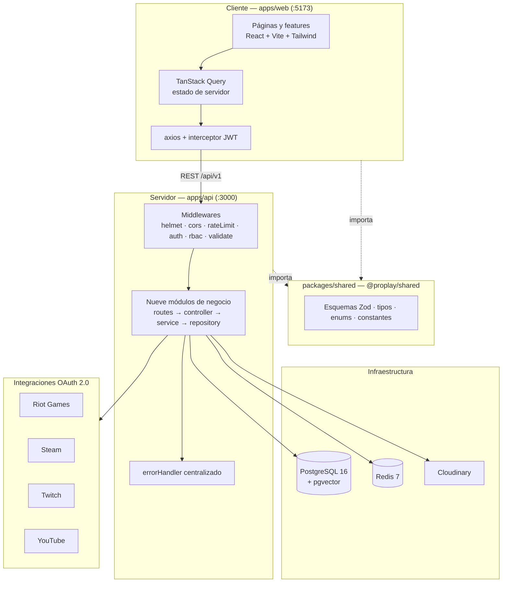
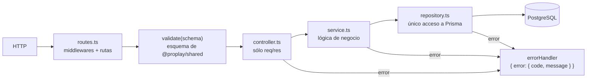
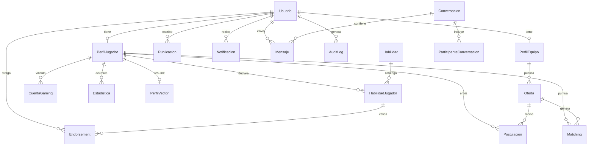
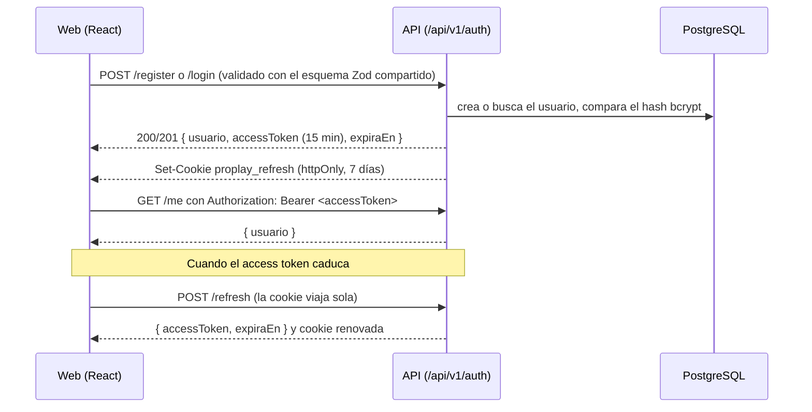

# Arquitectura de ProPlay

## Vista general

Monolito modular en el servidor con cliente desacoplado. Una sola aplicación
Express contiene los nueve módulos de negocio, separados por carpetas y no por
servicios; el contrato de la API vive en un paquete compartido que consumen
tanto el backend como el frontend.

## Capas del servidor

Cada petición recorre siempre el mismo camino. La regla es estricta: un
controlador no toca Prisma y un service tampoco; sólo el repository.

## Los nueve módulos

```mermaid
flowchart TB
    API["/api/v1"]
    API --> U["usuarios"]
    API --> P["perfiles"]
    API --> E["estadisticas"]
    API --> SC["scouting"]
    API --> M["matching"]
    API --> O["ofertas"]
    API --> MS["mensajeria"]
    API --> N["notificaciones"]
    API --> AD["admin"]

    U -.->|identidad| P
    P -.->|habilidades y cuentas| E
    E -.->|métricas| M
    P -.->|vector de perfil| M
    O -.->|requisitos| M
    M -.->|ranking| SC
    O -.->|postulaciones| N
    MS -.->|mensajes| N
    U -.->|auditoría| AD
```

| Módulo | Responsabilidad | Estado |
| --- | --- | --- |
| `usuarios` | Registro, login, refresco de sesión, `/me`, gestión de cuentas y auditoría de acceso | **Implementado** |
| `perfiles` | Perfil de jugador y de equipo, catálogo de habilidades, niveles, endorsements y vinculación de cuentas gaming | Andamiaje (501) |
| `estadisticas` | Métricas por jugador, juego y periodo; sincronización con las plataformas externas | Andamiaje (501) |
| `scouting` | Búsqueda y descubrimiento de jugadores con filtros de juego, rol, región y rendimiento; búsquedas guardadas | Andamiaje (501) |
| `matching` | Algoritmo de compatibilidad jugador ↔ oferta y ranking persistido | Andamiaje (501), con `calcularCompatibilidad` firmada |
| `ofertas` | Ofertas de los equipos y postulaciones de los jugadores con sus estados | Andamiaje (501) |
| `mensajeria` | Conversaciones y mensajes 1:1 y de equipo | Andamiaje (501) |
| `notificaciones` | Notificaciones in-app y su estado de lectura | Andamiaje (501) |
| `admin` | Métricas de la plataforma, moderación de cuentas y consulta del `AuditLog` | Andamiaje (501) |

## Modelo de datos

Definido en `apps/api/prisma/schema.prisma`, que hace también de documentación
del modelo.

Notas:

- `PerfilVector.dimensiones` es `Float[]` para que Prisma pueda leerlo y
  escribirlo; la columna `embedding vector(64)` la añade la migración
  `20260910145700_pgvector_perfil_vector` y es la que usarán las búsquedas de
  similitud.
- Los tokens de `CuentaGaming` se guardan cifrados con AES-256-GCM.
- Hay índices en las claves foráneas y en los campos por los que se filtra:
  `Oferta.juego`, `Oferta.region`, `Oferta.estado`, `Estadistica.jugadorId`,
  `Matching.ofertaId` y `Matching(ofertaId, puntaje)`.

## Algoritmo de compatibilidad

`calcularCompatibilidad(jugador, oferta)` (en `matching.service.ts`) devuelve
la media ponderada de cinco dimensiones. Los pesos son constantes configurables
en `@proplay/shared/constants` (`PESOS_MATCHING`), así que cliente y servidor
muestran y calculan siempre lo mismo.

| Dimensión | Peso | Qué mide |
| --- | --- | --- |
| `tecnica` | 0.35 | Estadísticas del jugador frente al rango y rol pedidos |
| `experiencia` | 0.20 | Años de trayectoria frente a `experienciaMinAnios` |
| `habilidadesBlandas` | 0.15 | Habilidades de categoría `BLANDA` endosadas y su nivel |
| `geografica` | 0.15 | Coincidencia de región y disposición a relocalizarse |
| `disponibilidad` | 0.15 | Horas semanales declaradas frente a las de la oferta |

Hoy devuelve un valor fijo: el contrato, el desglose y los pesos ya están
cerrados, la implementación es lo siguiente que toca.

## Flujo de autenticación

El access token vive sólo en memoria del cliente; la sesión sobrevive a la
recarga gracias a la cookie `httpOnly`, que el interceptor de axios usa para
refrescar y reintentar la petición fallida una única vez.

## Integraciones externas

Todas cumplen la interfaz `GameStatsProvider`
(`apps/api/src/integrations/GameStatsProvider.ts`) con tres métodos:
`vincularCuenta`, `obtenerEstadisticas` y `refrescarToken`. El registro de
`integrations/index.ts` resuelve el proveedor por plataforma, así que el módulo
`estadisticas` nunca depende de una implementación concreta. Riot es la primera
que se va a conectar y su clase ya documenta los endpoints del camino.
